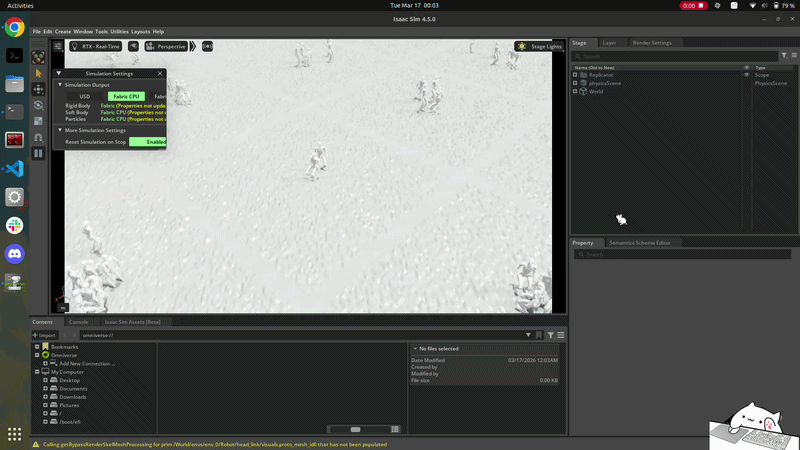

# Shape Shifting Robots for Navigating Snug Spaces

This repository contains reinforcement learning environments, training scripts, and deployment utilities for shape-shifting legged robots that adapt their posture to move through constrained spaces. The project is built around Isaac Lab, RSL-RL, and the Unitree G1 robot.

In particular, this repo includes crouch-walking behavior for navigating tighter passages while maintaining stable locomotion.

## Demo




## What Is In This Repo

- `envs/`: environment definitions and task registration.
- `mdp/`: reward terms and command generation logic.
- `terrains/`: terrain and height-scan utilities.
- `assets/`: robot assets, including the Unitree G1 description.
- `scripts/train.py`: RL training entrypoint.
- `scripts/play.py`: policy playback and export entrypoint.
- `policy/`: example exported policies.
- `sim2real/`: sim-to-real transfer code and robot-side deployment utilities.

## Tasks

The currently registered tasks include:

- `g1_flat`
- `g1_rough`
- `g1_crouch_flat`

The crouch task is the main shape-shifting setup for navigating snug spaces.

## Installation

This project expects an Isaac Lab environment with `rsl-rl-lib` available.

```bash
pip install -e .
```

## Training

Example training command:

```bash
python scripts/train.py --task=g1_crouch_flat --load_run=<log_directory> --checkpoint=<checkpoint.pt> --resume=True --logger=tensorboard - --num_envs=4000 --headless

python scripts/train.py --task=g1_flat --load_run=<log_directory> --checkpoint=<checkpoint.pt> --resume=True --logger=tensorboard - --num_envs=4000 --headless

```


## Playing Back a Trained Policy

Policy files for testing in sim can be found under policy/test_flat or policy/test_crouch

```bash
python scripts/play.py --task=g1_crouch_flat --load_run=<log_directory> --checkpoint=<checkpoint.pt> --num_envs=100
```

This script can also export trained policies to JIT and ONNX formats.

## Sim-to-Real

I also did sim2real for this project. The robot-specific deployment and runtime code lives in the `sim2real/` folder, including:

- robot runner code
- robot observations and configuration
- command and remote controller helpers
- G1-specific sim2real configuration

## Notes

- The package name is `shape_shift`.
- Logs are written under `logs/`.
- The repository includes Unitree G1 assets and policies related to crouch locomotion.
- This repo is under development. Actively working on developing the crawl and knee walking policies.
